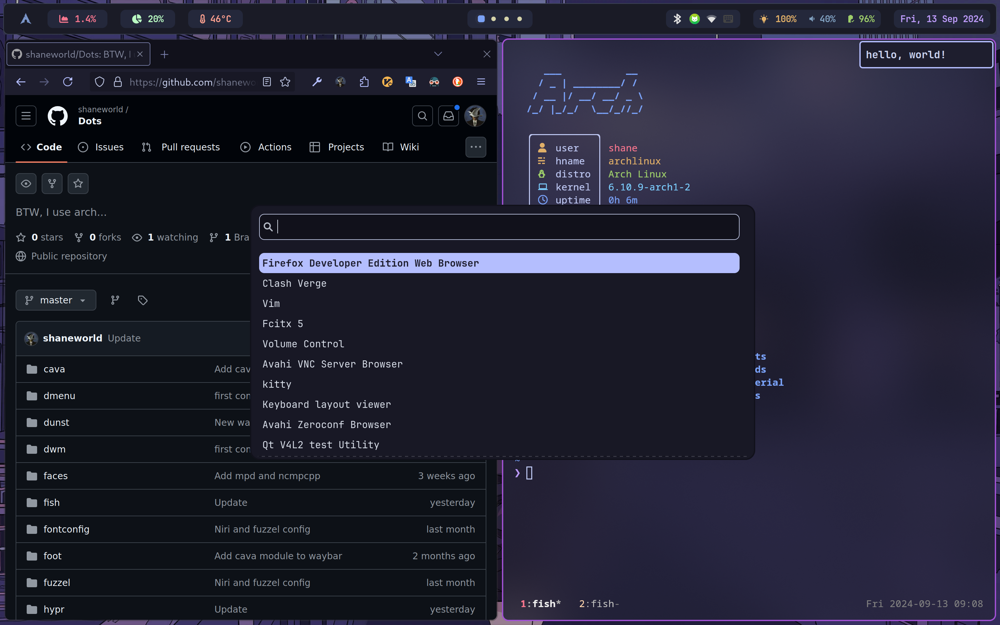

## Screenshots

## Packages

| Functions     | Packages                                                                           |
|:-------------:|:----------------------------------------------------------------------------------:|
| utils         | cliphist  brightnessctl  pamixer  bluez  bluez-utils  blueman  pavucontrol         |
| system info   | [nitch](https://github.com/ssleert/nitch)                                          |
| sddm theme    | qt5-quickcontrols  qt5-graphicaleffects  [sddm-chili](https://github.com/MarianArlt/sddm-chili) |
| gtk theme    | papirus-icon-theme nordic-darker-theme                                                               |
| fonts         | ttf-jetbrains-mono-nerd  ttf-roboto  noto-fonts-emoji  noto-fonts-cjk  adobe-source-han-sans-cn-fonts  adobe-source-han-serif-cn-fonts  ttf-dejavu ttf-font-awesome|
| wallpaper     | swaybg                                                                                |
| input method  | fcitx5-im  fcitx5-rime [fcitx5-sougou-themes](https://github.com/sxqsfun/fcitx5-sogou-themes)  [雾凇拼音](https://github.com/Mark24Code/rime-auto-deploy) |
| pdf reader    | zathura  zathura-pdf-mupdf  zathura-djvu                                           |
| screenshot    | slurp  grim                                                                        |
| browser       | firefox-developer-edition zen-browser(aur) |
| file browser  | [Yazi](https://github.com/sxyazi/yazi)                                             |
| editor        | neovim  [NvChad](https://nvchad.com/)                                              |
| launcher      | wofi                                                                               |
| status bar    | waybar                                                                        |
| terminal      | kitty                                                                        |
| tools         | libyaml asdf-vm eza ripgrep tmux obs-studio typst zip unzip fastfetch mpd mpc ncmpcpp|
| shell         | fish                                                                               |
| fish plugins  | [fisher](https://github.com/jorgebucaran/fisher)  [pure](https://github.com/pure-fish/pure)  [z](https://github.com/jethrokuan/z)  [autols](https://github.com/yuys13/autols.fish)  [Done](https://github.com/franciscolourenco/done)  [autopair](https://github.com/jorgebucaran/autopair.fish)|
| VPN           | [clash-verge-rev](https://github.com/clash-verge-rev/clash-verge-rev)              |

