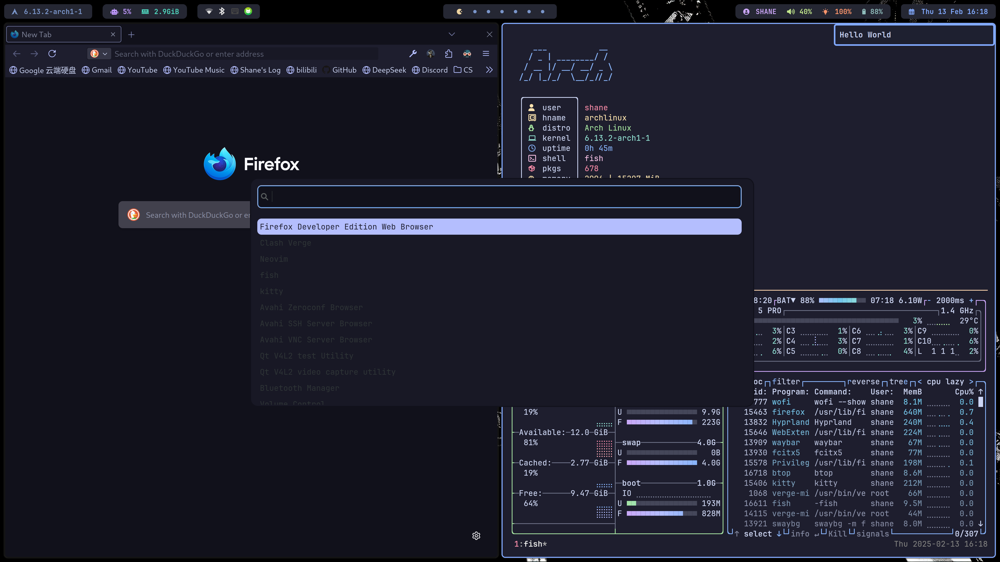
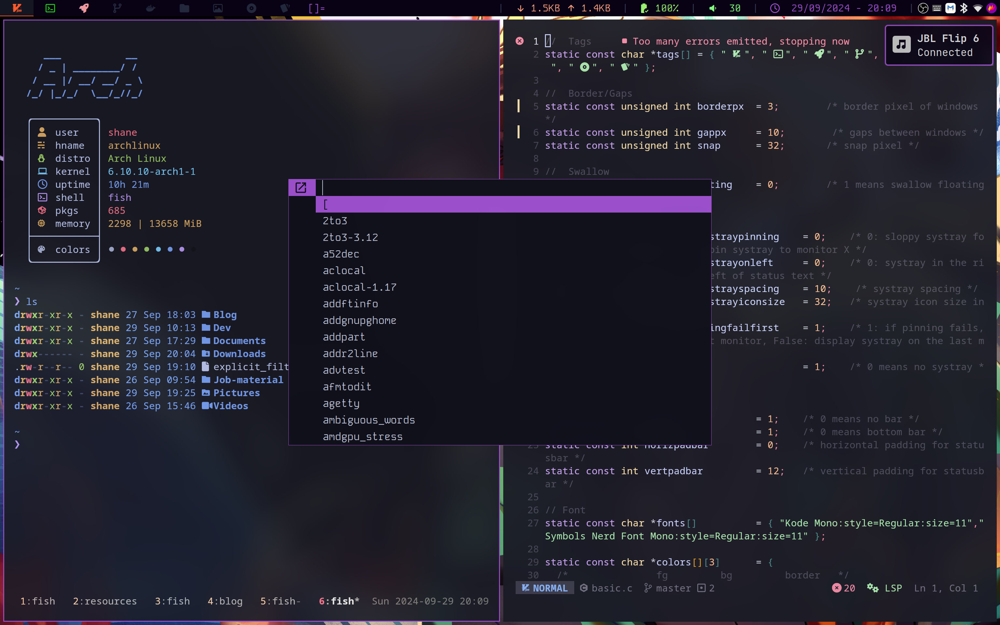

## Screenshots

#### Hyprland

#### DWM

## Packages

| Functions     | Packages                                                                           |
|:-------------:|:----------------------------------------------------------------------------------:|
| utils         | dunst libnotify cliphist brightnessctl pamixer network-manager-applet btop kwindowsystem eza bat ripgrep tmux zip unzip imv mpv xclip(dwm) |
| audio | pipewire pipewire-audio pipewire-pulse pipewire-jack pipewire-alsa |
| bluetooth | bluez bluez-utils blueman pavucontrol |
| system info   | [nitch](https://github.com/ssleert/nitch)                                          |
| sddm theme    | qt5-quickcontrols  qt5-graphicaleffects  [sddm-chili](https://github.com/MarianArlt/sddm-chili) |
| gtk theme    | papirus-icon-theme  [Catppuccine GTK Theme](https://store.kde.org/p/1715554/)(Catppuccin-Dark-B-MB) |
| fonts         | noto-fonts-cjk  ttf-jetbrains-mono-nerd  ttf-roboto noto-fonts-emoji adobe-source-han-sans-cn-fonts  adobe-source-han-serif-cn-fonts  ttf-dejavu ttf-font-awesome ttf-nerd-fonts-symbols-mono [KodeMono](https://fonts.google.com/specimen/Kode+Mono)(dwm) |
| wallpaper     | swaybg  feh(dwm)                                                     |
| input method  | fcitx5-im  fcitx5-rime [fcitx5-sougou-themes](https://github.com/sxqsfun/fcitx5-sogou-themes)  [雾凇拼音](https://github.com/Mark24Code/rime-auto-deploy) |
| pdf reader    | zathura  zathura-pdf-mupdf  zathura-djvu                                           |
| screenshot    | slurp  grim                                                               |
| browser       | firefox-developer-edition |
| file browser  | [Yazi](https://github.com/sxyazi/yazi)                                             |
| editor        | neovim  [NvChad](https://nvchad.com/)                                              |
| launcher      | wofi dmenu(dwm)                                                  |
| status bar    | waybar dwmblocks(dwm)                                           |
| terminal & shell      | kitty fish                               |
 fish plugins  | [fisher](https://github.com/jorgebucaran/fisher)  [z](https://github.com/jethrokuan/z) [autols](https://github.com/yuys13/autols.fish) [Done](https://github.com/franciscolourenco/done) [autopair](https://github.com/jorgebucaran/autopair.fish) [nvm.fish](https://github.com/jorgebucaran/nvm.fish)(for node.js)|
| vpn           | [clash-verge-rev](https://github.com/clash-verge-rev/clash-verge-rev)   |
| .xinitrc .Xresources (dwm) | `ln -s ~/.config/.xinitrc ~/.xinitrc`, `ln -s ~/.config/.Xresources ~/.Xresources`  |

## Acknowledgements

- DWM configuration based on [@ferDev27](https://github.com/ferDev27/dwm)'s dots.
